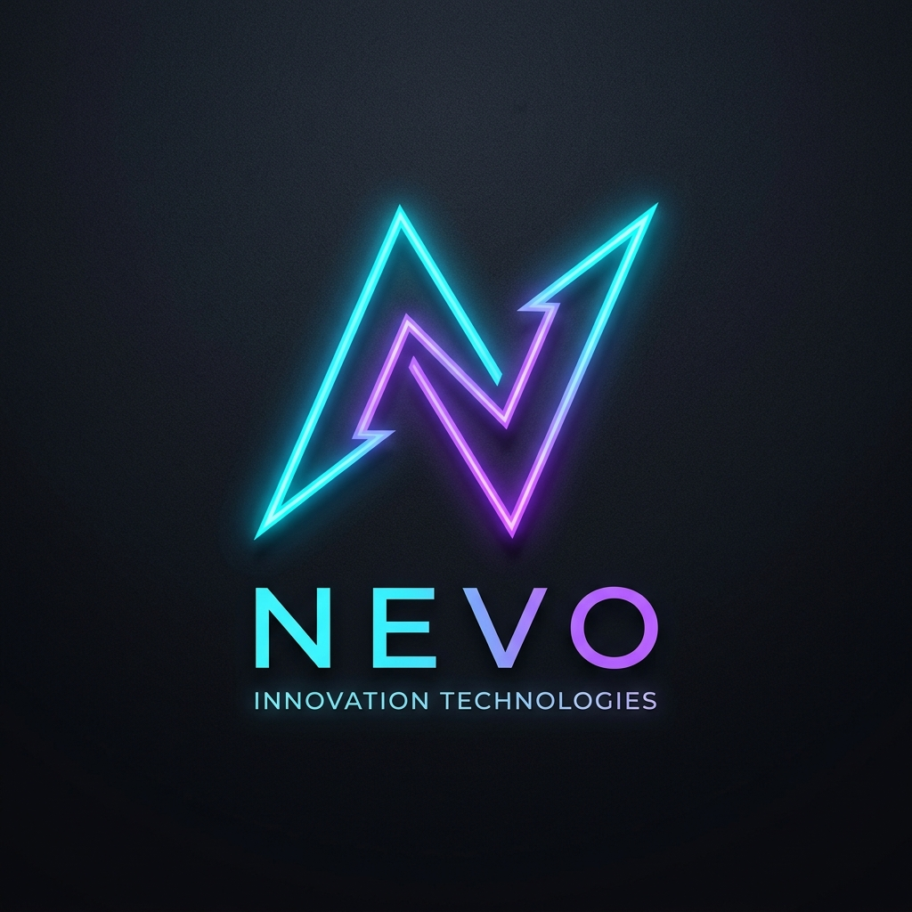

# 🚀 Nand Kumar | Full-Stack Developer & AI Portfolio

<div align="center">



### **Full-Stack Developer · AI & Data Science Engineer · Node.js Expert · Zoho Automation Specialist**

[](https://nandkumarcoder.github.io/nand-kumar-portfolio/)
[](https://nand-kumar-portfolio.onrender.com/api/health)
[](https://cloud.mongodb.com)
[](https://react.dev/)
[](https://nodejs.org)
[](LICENSE)

</div>

---

## 🌐 Live Deployments

- 💻 **Frontend Web App:** [https://nandkumarcoder.github.io/nand-kumar-portfolio/](https://nandkumarcoder.github.io/nand-kumar-portfolio/)
- ⚙️ **Production REST API:** [https://nand-kumar-portfolio.onrender.com/](https://nand-kumar-portfolio.onrender.com/)
- 🗄️ **Cloud Database:** MongoDB Atlas Cluster (`portfolio` database)

---

## 📖 Overview

A modern, production-grade **Full-Stack Developer Portfolio & Technical Publishing Platform** built with **React 18** on the frontend, **Node.js + Express** on the backend, and **MongoDB Atlas** in the cloud.

The platform showcases machine learning and web projects with high-definition previews, offers a dynamic multi-theme experience (Day, Night, System), includes a full-featured technical blogging CMS with rich markdown formatting, and supports secure user registration and direct inbox messaging.

---

## 🛠️ Tech Stack & Architecture

### 🎨 Frontend
- **Framework:** React 18 with Vite
- **Routing:** React Router (`HashRouter` for zero 404s on GitHub Pages)
- **Styling:** Custom Quantum Obsidian Design System (Glassmorphism & Neon HSL Accents)
- **Theming:** 3-Way Dynamic Engine (**Day / Light Mode**, **Night / Obsidian Dark Mode**, **System Auto Mode**)
- **Visuals:** HTML5 Canvas particle constellation network adapting dynamically to active themes
- **Icons:** Lucide React & Custom SVG Tech Stacks

### ⚙️ Backend & API
- **Runtime:** Node.js & Express.js
- **Database Layer:** Mongoose ORM connected to **MongoDB Atlas Cloud Cluster**
- **Authentication:** JSON Web Tokens (JWT) with `bcryptjs` password encryption
- **Security:** Strict email regex validation, password visibility toggle, and CORS configuration
- **Cloud Hosting:** Deployed on Render.com with auto-deploy pipelines

---

## ✨ Key Features

### 🌟 Interactive UI & Themes
- ☀️ **Day Mode:** Clean daylight sky gradient (`#e0f2fe` → `#f8fafc`) with high-contrast text and luminous glass cards.
- 🌙 **Night Mode:** Signature obsidian midnight gradient (`#161c36` → `#070913`) with neon cyan (`#00e5ff`) and purple glow borders.
- 🖥️ **System Preference Mode:** Automatically synchronizes with the user's operating system color scheme.
- ⌨️ **Hero Typing Animation:** Dynamic cycle showcasing: *Full-Stack Developer, AI Developer, Data Scientist, Node.js Specialist, Zoho Expert*.

### 🚀 Featured Projects Showcase
- **Neural Sales Forecaster** (Python, TensorFlow, LSTM, Pandas) — 94% accuracy inventory demand forecaster.
- **OmniTask Kanban Dashboard** (Node.js, Express, PostgreSQL, Glassmorphism UI) — Real-time team coordination workspace.
- **Custom CRM Leads Sync System** (Zoho Creator, Deluge Script, REST Webhooks) — Automated lead acquisition pipeline.
- **Sentiment & NLP Review Analyzer** (Python, NLTK, Scikit-Learn, Node.js) — Natural language text clustering & sentiment mapping.
- **Secure RESTful API Gateway** (Node.js, Express, JWT Auth) — High-throughput token-authenticated data exchange console.
- **Vendor Invoicing & Management Portal** (Zoho Creator, Deluge SQL, Zoho Analytics) — Low-code enterprise approval workflow.

### ✍️ Creator & Blogger CMS
- **MongoDB Atlas Persistence:** All registered authors, articles, comments, and likes are saved in cloud collections.
- **Admin Dashboard:** Manage and publish articles with tags, categories, cover photos, and view all registered users.
- **Secure Authentication:** Password visibility toggle (Eye/EyeOff icon) and real-time email format validation.

### 📬 Direct Inbox Delivery
- Contact submissions trigger direct delivery to **`nandkumarcoder@gmail.com`** with database backup logging.

---

## 📁 Repository Structure

```
nand-kumar-portfolio/
├── frontend/                     # React 18 + Vite Frontend Application
│   ├── src/
│   │   ├── assets/               # Logo and avatar assets
│   │   ├── components/           # Navbar, Hero, About, Skills, Projects, Contact, Footer
│   │   ├── context/              # AuthContext, ThemeContext
│   │   ├── pages/                # Home, BlogPage, BlogPostDetail, SignInPage, DashboardPage
│   │   ├── config/               # API base URL routing
│   │   ├── data/                 # Seed data and fallbacks
│   │   ├── App.jsx               # Top-level Router & Providers
│   │   ├── index.css             # Glassmorphic Theme Engine & CSS Variables
│   │   └── main.jsx              # React Entrypoint
│   ├── vite.config.js            # Vite build configuration
│   └── package.json
│
├── backend/                      # Node.js + Express REST API Server
│   ├── config/
│   │   └── db.js                 # MongoDB Atlas cloud database connector
│   ├── data/
│   │   └── dbManager.js          # Unified CRUD layer
│   ├── middleware/
│   │   └── auth.js               # JWT authentication middleware
│   ├── models/                   # Mongoose schemas (User, Blog, Contact)
│   ├── routes/                   # Auth, Blogs, Contact, Projects routes
│   ├── scripts/
│   │   └── seedAtlas.js          # One-command database migration script
│   ├── server.js                 # Express server configuration
│   └── package.json
│
├── api/
│   └── index.js                  # Serverless function entrypoint
├── render.yaml                   # Render.com cloud deployment blueprint
├── vercel.json                   # Vercel deployment blueprint
├── .github/workflows/deploy.yml  # GitHub Actions automated build & deployment
└── README.md
```

---

## 💻 Local Development Setup

### Prerequisites
- **Node.js** v18+ ([Download Node.js](https://nodejs.org))
- **Git**

### 1. Clone the repository
```bash
git clone https://github.com/nandkumarcoder/nand-kumar-portfolio.git
cd nand-kumar-portfolio
```

### 2. Configure & Run the Backend
```bash
cd backend
npm install
node server.js
# Backend API will start on http://localhost:5000
```

### 3. Start the React Frontend
```bash
cd ../frontend
npm install
npm run dev
# Frontend will start on http://localhost:5173
```

---

## 🚀 Cloud Deployment Commands

### Sync & Seed Data to MongoDB Atlas
To push all default users, articles, and data directly into your MongoDB Atlas cloud database:
```bash
cd backend
npm run seed:atlas
```

---

## 📬 Contact & Connect

<div align="center">

| Channel | Link |
|---|---|
| 📧 **Email** | [nandkumarcoder@gmail.com](mailto:nandkumarcoder@gmail.com) |
| 💼 **LinkedIn** | [linkedin.com/in/nand-kumar-943jf](https://www.linkedin.com/in/nand-kumar-943jf/) |
| 🐙 **GitHub** | [@nandkumarcoder](https://github.com/nandkumarcoder) |
| 📍 **Location** | Kanpur, Uttar Pradesh, India |

</div>

---

## 📄 License

This project is licensed under the **MIT License** — feel free to fork, customize, and star ⭐ this repository!

<div align="center">

Crafted with ❤️ by **Nand Kumar** | Full-Stack & AI Engineer

</div>
